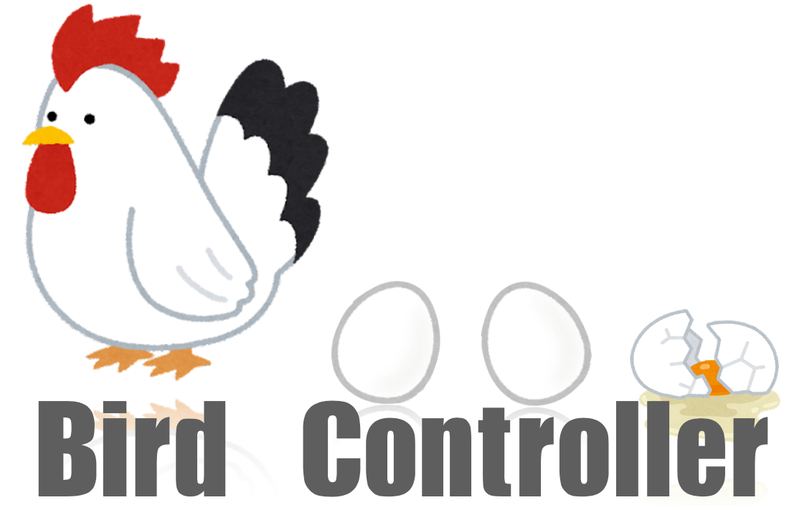

# bird-controller




<br>

`bird`リソースの`spec`で設定した数の卵(`egg`)を産卵するコントローラー。     

```
$ kubectl get bird
NAME     DESIRE_EGGS   READY_EGGS
bird-1   3             3
bird-2   2             2

$ kubectl get egg
NAME                                                   PARENT
egg-from-bird-1-6f68c282-4ab8-11ed-aeda-f0189849d5fd   bird-1
egg-from-bird-1-6f7540a2-4ab8-11ed-aeda-f0189849d5fd   bird-1
egg-from-bird-1-b0a66d5a-4ab6-11ed-9179-f0189849d5fd   bird-1
egg-from-bird-2-8f7ddd8e-4aa2-11ed-b6f0-f0189849d5fd   bird-2
egg-from-bird-2-8f839a9e-4aa2-11ed-b6f0-f0189849d5fd   bird-2
```

## Environment

```
$ kubebuilder version
Version: main.version{KubeBuilderVersion:"3.7.0", KubernetesVendor:"1.24.1", GitCommit:"3bfc84ec8767fa760d1771ce7a0cb05a9a8f6286", BuildDate:"2022-09-20T17:21:57Z", GoOs:"darwin", GoArch:"amd64"}
$ go version
go version go1.19 darwin/amd64
$ kind version
kind v0.15.0 go1.19 darwin/amd64
```

## Quick Start

```
$ make install
$ make run
```